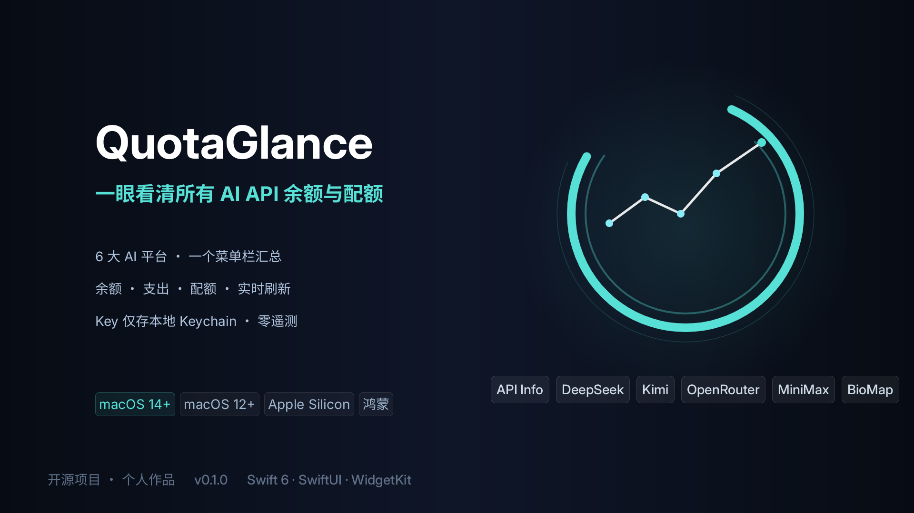
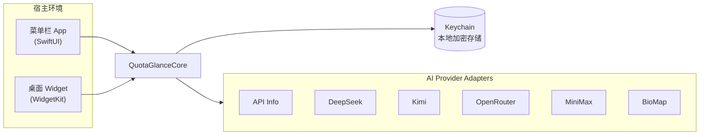

# QuotaGlance



<p align="center">
  <strong>一眼看清所有 AI API 余额与配额</strong><br/>
  <em>macOS 菜单栏 + 桌面小组件 · 本地优先 · 零遥测</em>
</p>

<p align="center">
  
  
  
  
  
</p>

QuotaGlance 是一个个人使用的 macOS / 鸿蒙菜单栏应用和桌面小组件，用于集中查看多个 AI API provider 的余额、消费上限、支出或订阅配额。

## ✨ 为什么选 QuotaGlance

- 🔐 **本地优先，零遥测** — 所有 API key 只存系统 Keychain，永不上传；没有任何第三方分析或崩溃上报。
- 📊 **一个菜单栏，看遍所有额度** — 最多 20 个具名账户，余额、消费上限、周期支出、配额窗口与趋势一屏汇总。
- 💱 **真实余额，不做假** — 只显示 provider 官方可查询的数据，按 CNY / USD 等币种分别呈现，绝不把配额伪装成现金。
- 🖥️ **菜单栏 + 桌面 Widget** — macOS 14 支持小 / 中 / 大三档桌面组件；失败重试、过期标记、低余额提醒一应俱全。
- 🌏 **跨平台** — macOS 与鸿蒙（HarmonyOS NEXT）客户端均已可用，双端共享契约 fixtures 保持行为一致。

## 🔌 支持的 AI 平台

| Provider | 余额币种 | 说明 |
| --- | --- | --- |
| **API Info** | – | 自有额度查询 |
| **DeepSeek** | USD / CNY | 账户或组织余额 |
| **Kimi** | CNY / USD | 中国站 / 国际站自动识别 |
| **OpenRouter** | USD | 标准 key 支出 + Management Key credits |
| **MiniMax** | 配额窗口 | Token / Coding Plan，非现金余额 |
| **BioMap Coding** | USD | 公司 LiteLLM `/key/info` 累计支出 |

> 不同 provider 暴露的官方能力并不相同，QuotaGlance 只显示真实可查询的数据，不会把消费上限、请求配额或连接状态伪装成现金余额。详细边界记录在 [`docs/research/provider-capabilities.md`](docs/research/provider-capabilities.md)。

## 🖥️ 支持平台

| 版本 | 系统要求 | 能力 |
| --- | --- | --- |
| **macOS 14 完整版** | macOS 14+ · Apple Silicon | 菜单栏 + 桌面 Widget（小 / 中 / 大）+ 开机启动 + 通知中心 |
| **macOS 12 兼容版** | macOS 12+ · Apple Silicon | 菜单栏核心功能 + 通知中心中号 Widget |
| **鸿蒙** | HarmonyOS NEXT 6.1+ | ArkTS 客户端（账户、卡片、System/English/简体中文），参考 [`docs/research/harmonyos-integration.md`](docs/research/harmonyos-integration.md) |

## 🏗️ 架构



## 🚀 快速开始

1. **获取应用** — 下载 Release 中的 DMG（`dist/QuotaGlance-<version>-macOS14-arm64.dmg`），或本地打包：`./scripts/package-dmg.sh`。
2. **安装** — 拖入 `Applications`，首次启动时按住 Control 点击应用选择「打开」。
3. **添加账户** — 点击菜单栏图标 → Settings → 选择 provider、填写 key 保存，菜单栏即刻显示余额。

## 🔒 隐私承诺

- 🔐 所有 API key 仅存于系统 **Keychain**，应用不会从 `.env` 导入，也不会写入源码或提交记录。
- 🚫 **零遥测**：无网络分析、无第三方崩溃上报，数据完全留在你的设备。
- 🏠 **本地优先**：失败时保留上次成功数据并标记过期，绝不上传任何使用行为。

## HarmonyOS 版本

`HarmonyOS/` 目录是鸿蒙（HarmonyOS NEXT，手机/平板）版本，与 macOS 版能力对齐：同一套六家 provider、同样的快照数据模型、同样的品牌图标与配色。账户 key 保存在系统 Asset Store（按账户独立 alias，首次解锁后可读），不会以明文落盘，也不会进入快照或日志。

- 双端解析逻辑通过共享契约 fixtures 防止漂移：`Contracts/Providers/` 是唯一事实来源，Swift 与 ArkTS 的契约测试各自跑同一份文件（鸿蒙侧由 `scripts/sync-contracts-to-harmonyos.sh` 同步进 ohosTest rawfile）。新增或修改 provider 时必须同时更新 fixtures 与两端测试，详见 [`Contracts/README.md`](Contracts/README.md)。
- 构建：`scripts/build-harmonyos.sh`（本机需 DevEco Studio，CI 用 `ErBWs/setup-ohos`）；图标由 `scripts/generate-harmonyos-icon.swift` 生成，与 macOS 图标同一设计。
- 平台调研、密钥方案选型与实现状态：[`docs/research/harmonyos-integration.md`](docs/research/harmonyos-integration.md)。


## 功能

- 管理最多 20 个具名 provider 账户，key 只保存在 macOS Keychain。
- 添加 key 时选择 provider；Kimi 和 MiniMax 自动识别中国站或国际站，OpenRouter 自动识别标准 key 或 Management Key，BioMap Coding 使用固定的公司 LiteLLM 地址。
- 菜单栏按账户实际能力显示余额明细、消费上限、周期支出、配额窗口、近期趋势和模型用量。
- All Accounts 只汇总真实余额，并按 `CNY`（人民币）和 `USD`（美元）等币种分别显示，不做汇率换算。
- 刷新间隔可选 1、5、15、30 或 60 分钟，默认 5 分钟。
- macOS 14 完整版支持小、中、大三种 Widget，并可配置为全部账户或指定账户。
- 网络或接口失败时保留上次成功数据并标记为过期。
- 对具有真实余额的账户提供可选低余额通知；MiniMax、BioMap Coding 和 OpenRouter 标准 key 不显示该设置。
- 支持开机启动。

## 系统要求

- macOS 12 兼容版：macOS 12 或更高版本，提供菜单栏核心功能与通知中心中号小组件，不包含桌面小组件和开机启动。
- macOS 14 完整版：macOS 14 或更高版本，额外提供桌面小组件和开机启动，并同样包含通知中心小组件。
- 当前分发产物仅支持 Apple Silicon Mac（M1 或更新）。

## 源码构建要求

- 完整版 Xcode，安装在 `/Applications/Xcode.app`。本地构建依赖 Xcode 生成 Widget 的 App Intent 元数据。
- Xcode Command Line Tools。缺少时执行：`xcode-select --install`。
- [ripgrep](https://github.com/BurntSushi/ripgrep)：`brew install ripgrep`。

首次使用 Xcode 后，需接受许可并完成组件安装：

  ```bash
  sudo xcodebuild -license accept
  sudo xcodebuild -runFirstLaunch
  ```

- Xcode 工程已包含在仓库中。仅在修改 `project.yml` 后需要 [XcodeGen](https://github.com/yonaskolb/XcodeGen)：`brew install xcodegen`。

## 可选的 Xcode 签名

1. 执行 `xcodegen generate`，然后打开 `QuotaGlance.xcodeproj`。
2. 在 `QuotaGlance` 和 `QuotaGlanceWidget` 两个 target 的 Signing & Capabilities 中选择同一个 Team，并保持 Automatically manage signing 开启。
3. 确认两个 target 都包含 App Groups capability，且组名均为 `group.com.liangrui.QuotaGlance`。
4. 若该 App Group 已被其他开发者账号占用，请在 `project.yml`、两个 entitlements 文件和 `Sources/QuotaGlanceCore/Storage/SharedSnapshotStore.swift` 中统一改成属于你的唯一标识，然后重新执行 `xcodegen generate`。

## 构建与安装

先运行核心测试：

```bash
swift test
```

开发构建并启动：

```bash
./script/build_and_run.sh
```

Release 构建、本地安装并注册 Widget（macOS 14 完整版）：

```bash
./scripts/install-local.sh [full|legacy]
```

默认构建使用完整版 Xcode 生成可配置 Widget 所需的 App Intent 元数据，然后使用稳定的本地临时签名；不需要 App Store 或 Apple Developer 证书。安装器会将应用放到 `~/Applications/QuotaGlance.app`。若已有同 bundle ID 的版本，会先移动到 `~/Library/Application Support/QuotaGlance/Backups`；若目标路径属于其他 bundle ID，安装器会拒绝覆盖。

## 生成发布版 DMG

默认同时生成 macOS 12 兼容版和 macOS 14 完整版；两者都使用临时签名且未经过 Apple 公证：

```bash
./scripts/package-dmg.sh
```

产物位于 `dist/QuotaGlance-<version>-macOS12-arm64.dmg` 和 `dist/QuotaGlance-<version>-macOS14-arm64.dmg`，相邻的 `.sha256` 文件用于校验下载或传输完整性。DMG 仅包含应用本体、安装说明和 `Applications` 快捷方式，属于纯净发布产物。

只生成一个版本时，可在输出目录后指定 `legacy` 或 `full`：

```bash
./scripts/package-dmg.sh dist legacy
./scripts/package-dmg.sh dist full
```

两个版本使用相同 bundle ID，请勿同时安装；从一个版本切换到另一个版本时，先替换 Applications 中的现有 app，账户设置和 Keychain key 会保留。

接收者需将应用拖入 Applications，并在首次启动时按住 Control 点击应用后选择“打开”；如果仍被拦截，请在“系统设置 > 隐私与安全性”中选择“仍要打开”。这是临时签名版本的已知限制，不代表 DMG 损坏。

## GitHub Actions

- `CI` 会在 pull request 和推送到 `main` 时自动执行仓库验证，包括 `swift test`、版本构建约束、DMG 打包约束和本地安装安全检查。
- `Release` 会在推送 `v*` tag 时自动打包 DMG，并把 `dist/*.dmg` 与对应的 `.sha256` 发布到 GitHub Release。

示例：

```bash
git tag v0.1.0
git push origin v0.1.0
```

后续跨平台、国际化和商店发布安排记录在 [`docs/roadmap.md`](docs/roadmap.md)。

## 添加账户

1. 点击菜单栏中的 QuotaGlance 图标，打开 Settings。
2. 选择 API Info、DeepSeek、Kimi、OpenRouter、MiniMax 或 BioMap Coding，填写账户名称和 key 后保存。BioMap Coding 固定连接 `https://coding.biomap-int.com`。
3. 保存过程中会验证 key 并自动识别地域或 key 类型；识别结果会显示在 Settings 的账户行中。
4. 重复添加其他账户；当前设计最多支持 20 个。
5. 在菜单栏面板切换 All Accounts 或单个账户，使用刷新按钮立即更新。

Provider 特殊情况：

- Kimi 中国站余额使用 `CNY`，国际站余额使用 `USD`。应用先按当前系统地域尝试官方端点，仅在明确的 401/403 鉴权拒绝后尝试另一地域；后续刷新只访问已识别地域。
- OpenRouter 标准 key 显示该 key 的支出和可选消费上限；Management Key 还会读取账户 credits，并将其作为 `USD` 余额。
- MiniMax 只支持 Token/Coding Plan subscription key，并显示非现金的配额窗口。`sk-api-...` 按量付费 key 会在请求前被拒绝，因为 MiniMax 没有公开官方现金余额查询接口。
- BioMap Coding 从公司 LiteLLM 的 `GET /key/info` 读取该虚拟 key 的累计 `USD` 支出与可选消费上限。剩余额度按上限减累计支出展示，但它不是现金余额，不会进入 All Accounts 余额汇总；若部署禁止访问 key-info 管理路由，应用仅在 403/404/405 时改用 `GET /v1/models` 验证连接，并明确提示预算指标不可用。
- DeepSeek 和 Kimi 的余额可能属于整个账户或组织。同一 provider 账户下添加多个 key 可能让 All Accounts 重复计算同一份余额，应用无法从官方响应中可靠识别这种重复。

不要把真实 key 写入源码、提交记录或仓库内的 `.env`。QuotaGlance 不会从 `.env` 导入 key；请只通过应用内的安全编辑器录入。

升级前保存的 API Info 账户会自动迁移，原 UUID、设置和 Keychain 项保持不变。为避免凭据迁移风险，Keychain service identifier 仍使用历史名称 `com.liangrui.QuotaGlance.api-info`；它现在只是所有 provider key 共用的内部存储命名空间。

当前临时签名版本升级后，macOS 可能要求为新 app build 重新批准已有 Keychain 项。QuotaGlance 的启动和定时刷新不会主动弹出认证窗口；界面显示 `Keychain Locked` 时，点击刷新按钮，再按系统提示批准对应 key 即可。Developer ID 或 App Store 稳定签名会从根本上消除 build 身份变化。

## 添加桌面小组件（仅 macOS 14 完整版）

1. 先启动 QuotaGlance 并至少成功刷新一次。
2. 在桌面空白处右键，选择 Edit Widgets。
3. 搜索 QuotaGlance，选择名为 `QuotaGlance` 的可配置组件，再添加小、中或大尺寸。
4. 右键该组件并选择 Edit Widget，可切换 All Accounts 或某个账户。

升级前已经放在桌面的组件会继续作为固定的 `All Accounts` 总览运行，以避免 WidgetKit 迁移时白屏；需要显示指定账户时，请从 Gallery 新增 `QuotaGlance` 可配置组件。

WidgetKit 的后台时间线由系统调度，菜单栏应用会按设置的间隔请求数据，并在写入共享快照后通知所有组件刷新。

## 验证密钥未进入产物

应用安装后，可使用当前 shell 中的任一 provider key 检查 Git 跟踪文件和已安装 app。脚本不会打印 key，也不会把 key 放在进程参数中：

```bash
export LAOGE_KEY='你的 key'
./scripts/verify-no-secret.sh
```

多个 key 可分别执行一次。

## Widget 故障排查

- Gallery 中找不到 QuotaGlance：启动安装后的应用一次，再执行 `pluginkit -a "$HOME/Applications/QuotaGlance.app/Contents/PlugIns/QuotaGlanceWidget.appex"`，随后重新打开 Gallery。
- 组件仍显示旧版本：移除桌面组件，结束 QuotaGlance 后重新执行 `./scripts/install-local.sh`，再重新添加组件；必要时注销并重新登录 macOS。
- 深色桌面下组件发灰或模糊：macOS 会统一调暗桌面组件。若需要始终保持完整对比度，在 System Settings → Desktop & Dock → Widgets 中将 Dim widgets on desktop 改为 Never。
- 组件显示过期：打开菜单栏面板手动刷新，并检查账户 key 的验证状态和网络连接。失败时旧余额会保留，不会被清空。
- App Group 读取失败：确认宿主与 Widget 使用同一个签名 Team、同一个 App Group entitlement，并重新生成 Xcode 项目后安装。
